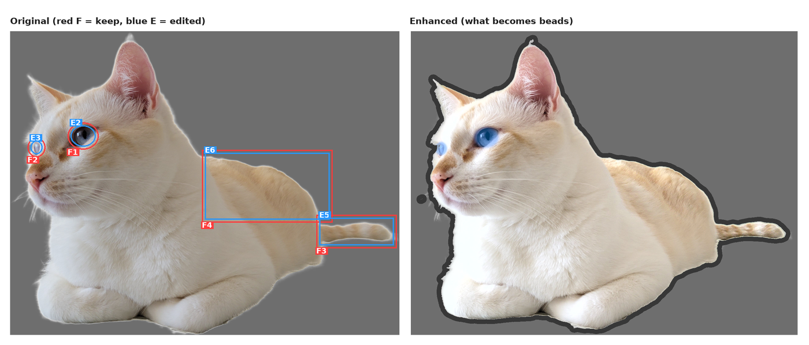
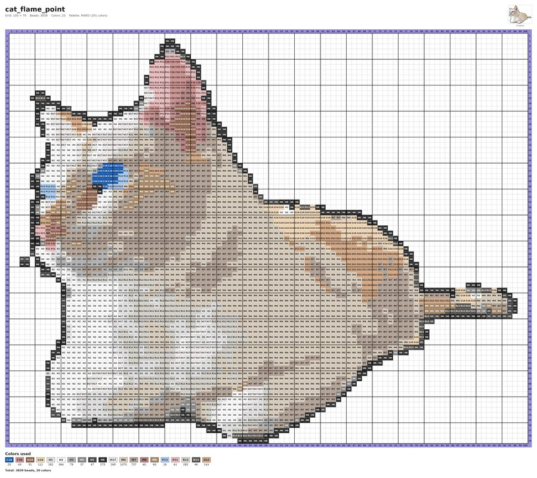

# beadify

[](https://github.com/YOUR_USERNAME/beadify/actions/workflows/tests.yml)
[](LICENSE)
[](pyproject.toml)

Turn a photo into a printable fuse-bead (Perler / Hama / MARD) pattern chart — with an optional AI step
that keeps small, identity-defining features (an eye color, a marking, a tail ring) alive through the
color reduction, instead of quietly averaging them away.

<p align="center">
  
</p>
<p align="center">
  
</p>

More examples in [`examples/`](examples/).

## What a chart looks like

- a grid of square cells, one per bead, filled with the bead color
- the color code written in every cell (e.g. `B19`, `C6`)
- row and column numbers on all four sides
- a bold line after every 5th row / column, plus a bold outer border
- empty cells (no bead) for the background
- a legend below the chart listing every color code with its bead count, and the total
- a header with the title, grid size, bead / color counts and a thumbnail of the original photo

## Install

```bash
pip install .             # from this directory; provides the `beadify` command
```

Use `pip install -e .` for an editable install (needs a recent pip, roughly 23+; older pips fail with
"missing the 'build_editable' hook" - upgrade pip or use the plain install).

Requires Python 3.8+ (numpy, Pillow, scipy, scikit-image). Without installing you can also run
`PYTHONPATH=src python3 -m beadify ...`.

## Usage

```bash
beadify photo.jpg                          # -> photo_pattern.png, longest side 100 beads
beadify photo.jpg -o out/cat.png --size 50 --max-colors 12
beadify logo.png --width 29 --height 29    # center-crops to a square, no stretching
beadify photo.jpg --mirror                 # flipped left-to-right for pieces ironed from the back
```

| Option | Meaning |
|---|---|
| `--size N` | length of the longest side in beads; aspect ratio is kept (default 100) |
| `--width W` / `--height H` | exact grid width / height. One alone keeps the aspect ratio; both center-crop the photo |
| `--max-colors N` | limit the number of different colors (least costly colors are merged into their nearest kept neighbor) |
| `--denoise` | replace isolated single beads with their surrounding color |
| `--saturation F`, `--contrast F` | adjust the small image before color matching (default 1.0) |
| `--bg auto\|none` | `auto` (default): use PNG transparency, otherwise remove a uniform background connected to the image border. `none`: keep every cell |
| `--bg-color '#RRGGBB'`, `--bg-tolerance D` | force the background color / CIEDE2000 tolerance (default 12) |
| `--palette file.csv` | custom palette with columns `code,r,g,b` (default: bundled MARD 291 colors) |
| `--title T` | chart title (default: input file name) |
| `--mirror` | mirror the chart left-to-right |
| `--cell-size PX` | cell size in pixels (default 40) |
| `--no-preview` | omit the original-photo thumbnail |

Python API:

```python
from beadify import build_pattern, render_pattern

pattern = build_pattern("photo.jpg", size=60, max_colors=15)
render_pattern(pattern, title="My pattern").save("pattern.png")
print(pattern.counts(), pattern.total_beads)
```

## AI-assisted preparation (optional)

Small but identity-defining features (a cat's blue eyes, tail rings) and dim lighting are the things a
plain "average the photo, pick the nearest bead" conversion loses. `beadify-ai` adds a reviewed step *in
front of* the unchanged beadify pipeline (nothing in the core is modified):

1. **Analyze** - Claude looks at the photo, identifies the subject and the features that must survive,
   explains why each is at risk, and proposes edits from a fixed catalog: `exposure`, `contrast`,
   `saturation`, `local_contrast`, `colorize` (make a tiny key color, such as an iris, survive matching),
   `smooth`, `cutout` (remove a cluttered background, guided by a rough polygon around the subject that
   is refined from the image colors), `crop`, `outline`. It never draws or adds anything — no generative
   image model is involved, only numeric adjustments to the existing pixels.
2. **Edit** - the edits are applied deterministically, giving an edited 2D image.
3. **Confirm** - you get `comparison.png` (original with the regions marked, next to the edited image) and
   `changes.md` (what was changed, where, and why). Nothing is charted yet.
4. **Chart** - after you confirm, the ordinary beadify pipeline (color detection, nearest bead color,
   chart) runs on the edited image.

```bash
pip install ".[ai]"                                   # adds the `anthropic` package
export ANTHROPIC_API_KEY=...                          # or run `ant auth login`

beadify-ai enhance photo.png -w work/                 # steps 1-3
# review work/comparison.png and work/changes.md
beadify-ai enhance photo.png -w work/ --feedback "leave the ears alone"   # ask the AI to revise
beadify-ai chart -w work/ --yes -o chart.png --max-colors 12             # step 4 (extra options go to beadify)
beadify-ai run photo.png -o chart.png                 # all steps with an interactive confirmation
```

`work/plan.json` is plain JSON: edit it by hand and re-run `beadify-ai enhance photo.png -w work/ --plan
work/plan.json` to skip the AI (no API key needed). `beadify-ai grid photo.png` saves the photo with a 0-1
coordinate grid, which is what the AI sees when it places regions.

See [`examples/calico_cat_cutout/`](examples/calico_cat_cutout/) for a photo where the subject is small and
sits on a cluttered background: `cutout` + `crop` isolate it before the color edits run.

Notes: the default model is `claude-opus-5` (`--model` to change it). `--fallbacks` asks the API to retry
on a fallback model if the primary one declines a request; it needs a recent `anthropic` SDK. Only the
photo is sent to the API. Images are edited at up to 2048 px on the long side.

## How it works

1. Load the image (EXIF rotation applied) and downscale it to the bead grid with an area-aware filter,
   keeping the aspect ratio. Transparent pixels are premultiplied so they do not darken the edges.
2. Detect the background (PNG alpha, or flood fill from the border over cells close to the border color).
3. Convert every remaining cell to CIELAB and pick the nearest palette color by CIEDE2000 distance
   (perceptually closer than plain RGB distance).
4. Optionally reduce the number of colors, remove isolated beads and mirror the grid.
5. Render the chart with Pillow.

## How this compares to other bead-pattern tools

There are several good pixelation tools already; here's honestly where this one sits.

| | This project | [Zippland/perler-beads](https://github.com/Zippland/perler-beads) | [liangdabiao/perler-beads-skill](https://github.com/liangdabiao/perler-beads-skill) | [Jett-Wu/Perler_Beads_Generator](https://github.com/Jett-Wu/Perler_Beads_Generator) | [CIawevy/pindou-skill](https://github.com/CIawevy/pindou-skill) |
|---|---|---|---|---|---|
| Form | Python library + CLI | Hosted web app (Next.js) | Node CLI / Claude Code skill | Web app (React + Three.js) | Python / Claude Code skill |
| Color matching | CIEDE2000 (Lab) | RGB distance (CIEDE2000 on their roadmap) | RGB or Lab | RGB-based | Lab / CIEDE2000 |
| AI-assisted enhancement | Vision analysis → structured, reviewable, deterministic edits (no image generation) | none | generative image *redraw* (external image-gen model, fixed style prompt) | none (manual sliders) | generative image *redraw* (gpt-image-2) then re-extracts colors from that image |
| Manual editing UI | none (scriptable by design) | full pixel editor, magnifier, custom palettes | none | full editor: layers, 3D preview, text tool | none |
| Automated tests | 40 pytest tests, incl. a mocked-API test suite for the AI step | none found | none found | none found | none found |

The two projects that already add an AI step before quantizing (liangdabiao, CIawevy) do it by asking an
image-generation model to **redraw the whole photo** in a fixed style ("chibi, pixel art"). That can
hallucinate detail and doesn't guarantee the subject's real proportions or colors survive. This project's
AI step never generates pixels: it only decides *where* and *by how much* to adjust brightness, contrast,
color and outline of the photo that's already there, and shows you the reasoning and the diff
(`comparison.png` + `changes.md`) before anything is charted — re-running the same edits later needs no
API call, just the saved `plan.json`.

If you want a full-featured, actively developed web app with a manual pixel editor and a large color-brand
library, Zippland's or Jett-Wu's projects are the better fit today. This project's niche is scriptable,
reviewable, high-fidelity conversion — useful in an automated pipeline or when you don't want a generative
model inventing detail that isn't in your photo.

## Notes

- Palette RGB values are on-screen approximations; real beads vary by batch and lighting. Check the
  final color choices against a physical color card.
- A 100 x 100 chart is 10,000 beads (several pegboards); it is best read on screen or printed in sections.
  Use `--size` or `--width/--height` for smaller pieces.
- The bundled MARD palette comes from [maxcleme/beadcolors](https://github.com/maxcleme/beadcolors) (MIT);
  see `NOTICE.md`.

## Development

```bash
pip install -e ".[dev]"
pytest
```

CI (`.github/workflows/tests.yml`) runs the suite on Python 3.9, 3.11 and 3.12 for every push and pull
request. See [`CONTRIBUTING.md`](CONTRIBUTING.md) for the project layout and guidelines.

## License

[MIT](LICENSE)
